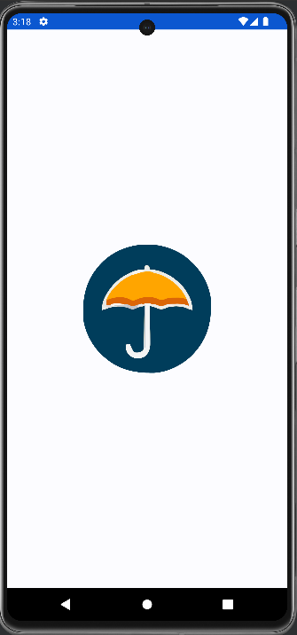
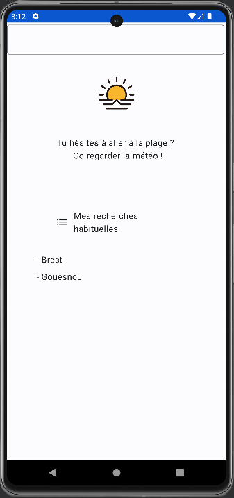
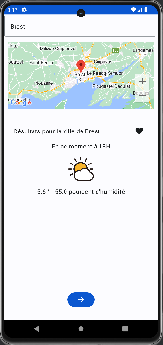
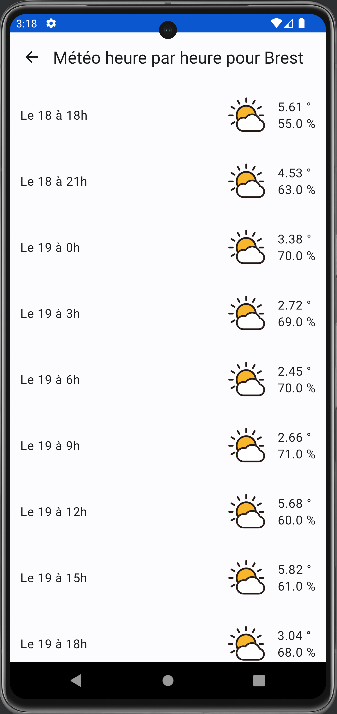

# Weather App

## Spring Boot

Revue de l'architecture. Utilisation de plusieurs outils.

## Android

Logiciel : Android Studio.

Utilisation de : Koin, Ktor, Navigation, Location, Map, Lottie, Datastore, Room.

### Screens

 \

